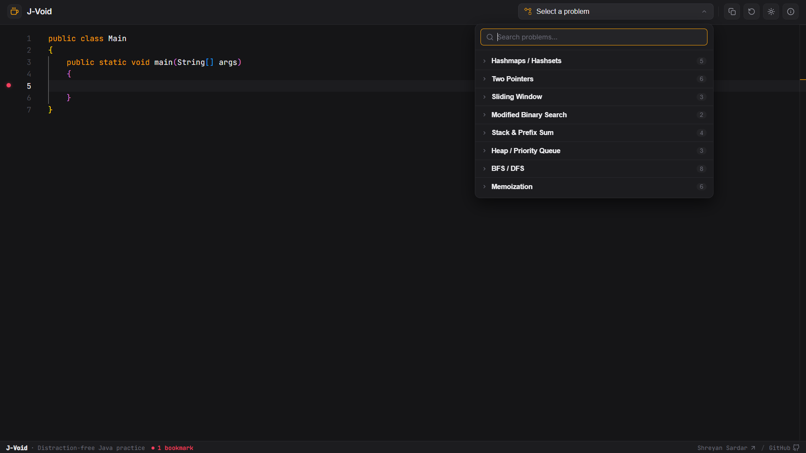

#  J-Void

A lightweight, in-browser Java editor to practice syntax and interview patterns with zero compilation lag. Built as the companion editor for [Shreyan's Arc](https://shreyans-arc.vercel.app/).

[](https://j-void.vercel.app/)
[](https://shreyans-arc.vercel.app/)

---

## Preview

| Main Interface & Workflow |
| :---: |
|  |

---

## Features

- **Instant Editor**: Write and edit Java code immediately in the browser with zero setup or build latency.
- **58 Curated Problems**: Pre-loaded problem templates matching the [Shreyan's Arc](https://shreyans-arc.vercel.app/) DSA roadmap.
- **Allman Formatting**: Auto-generated method signatures and starter templates structured with Allman-style braces.
- **Gutter Bookmarks**: Click editor gutter line numbers to bookmark lines with hover preview support.
- **Responsive & Themed**: Dark and light mode persistence with a mobile-ready collapsible problem drawer.

---

## Tech Stack

- **Frontend**: React 19, Monaco Editor (`@monaco-editor/react`), Vite, Vanilla CSS
- **Deployment & Infra**: Vercel
- **AI Tooling**: Antigravity, Cursor

---

## Project Structure

```text
j-void/
├── frontend-app/
│   ├── public/                 # Static assets (logo, preview screenshots, favicon)
│   ├── src/
│   │   ├── components/         # Editor, Header, QuestionSelector, and ThemeToggle UI
│   │   ├── data/               # DSA problem bank and boilerplate generators
│   │   ├── App.jsx             # Main application state and layout coordinator
│   │   └── main.jsx            # Application entry point
│   ├── index.html              # HTML template
│   ├── package.json            # Dependencies and scripts
│   └── vite.config.js          # Vite configuration
└── README.md                   # Project documentation
```

---

## Getting Started

### Prerequisites

- **Node.js**: `v18.0.0` or higher
- **npm**: `v9.0.0` or higher
- **Git**: `2.x` or higher

### 1. Clone & Install

```bash
git clone https://github.com/ShreyanDev5/j-void.git
cd j-void/frontend-app
npm install
```

### 2. Run Development Server

```bash
npm run dev
```

Open [http://localhost:5173](http://localhost:5173) in your browser.

---

## Deployment

- **Live Application**: [j-void.vercel.app](https://j-void.vercel.app)
- **Companion App**: [shreyans-arc.vercel.app](https://shreyans-arc.vercel.app)
- **Platform**: Hosted on [Vercel](https://vercel.com)

---

## Author

**Shreyan Sardar**
- **Portfolio**: [shreyandev.vercel.app](https://shreyandev.vercel.app)
- **GitHub**: [@ShreyanDev5](https://github.com/ShreyanDev5)
- **LinkedIn**: [shreyansardar](https://www.linkedin.com/in/shreyansardar/)
